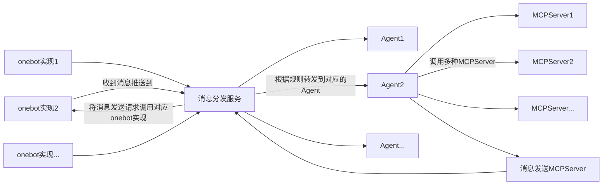
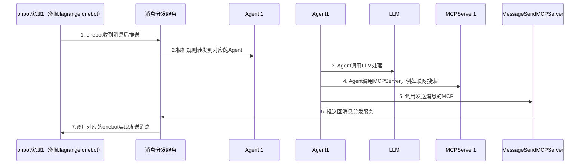

# 云原生架构适用于 onebot 协议的 Agent框架

[English](./docs/README_EN.md) | [中文](README.md)

## 为什么要做这个项目？

一句话总结：**把“消息入口”“决策能力”“工具调用”“协议发送”四件事切干净，再用云原生方式把弹性、可演进能力提前内建**。具体的背景、设计目标、适用场景等请参考[为什么要做这个项目](./docs/why.md)。

## 快速开始

请参考[快速开始](./docs/quickstart.md)，更详细的说明和部署文档请查看[部署文档](./docs/deployment.md)。

## 系统架构

## 交互流程

## 服务列表

## lagrange-core

lagrange.onebot可执行文件。

## message-dispatch 

消息分发以及接收发送服务。

## message-mcp

消息发送的MCP服务器。

