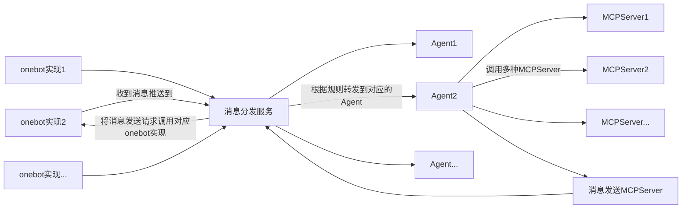
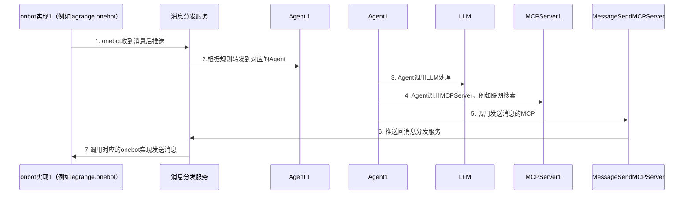

# 云原生架构适用于 onebot 协议的 Agent框架

[English](./docs/README_EN.md) | [中文](README.md)

## 为什么要做这个项目？

目前，市面上的各类机器人非常多。但大多数机器人都是单体应用，例如，只能针对QQ等。另外，现有机器人系统，其运行逻辑与特定终端（如QQ、微信等）强耦合，导致机器人功能的扩展和维护非常困难。

我希望做到的是：

1. **多种接入方式统一处理**：将机器人功能与具体的onebot实现解耦，使得机器人可以支持多种onebot实现（如lagrange.onebot、go-cqhttp等），不同平台消息会转发到统一的消息分发服务。
2. **消息分发**：设计一个消息分发服务，负责接收来自不同onebot实现的消息，并根据*自定义预设规则*将消息转发到不同的微服务。
3. **功能微服务化**：将消息处理逻辑设计为微服务，每个微服务只负责处理消息逻辑，不与具体的onebot实现耦合。
4. **云原生部署**：利用Docker和Kubernetes等技术，实现机器人系统的容器化和编排，方便部署和扩展。

预期的效果是：

- 你有两个聊天软件的多个账号（如QQ和微信），你可以设定一系列规则，将不同账号的消息转发到不同的微服务进行处理。
- 例如你做了一个开源项目叫做OpenMCP，同时有微信群和QQ群，你希望两个群的消息都交由同一个微服务处理，来管理和回答群聊中的用户的问题。这个服务处理完成后，会将消息发送回原来的群，不论是QQ还是微信。
- 例如你和女朋友同时使用QQ和微信聊天，你希望有一个助理能记住你们来自两个平台的历史对话，并可以检索特定信息来帮助你。

## 系统架构

## 交互流程

## 服务列表

## lagrange-core

lagrange.onebot可执行文件。

## message-dispatch 

消息分发以及接收发送服务。

## message-mcp

消息发送的MCP服务器。

