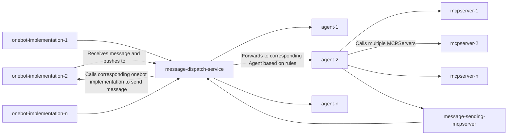
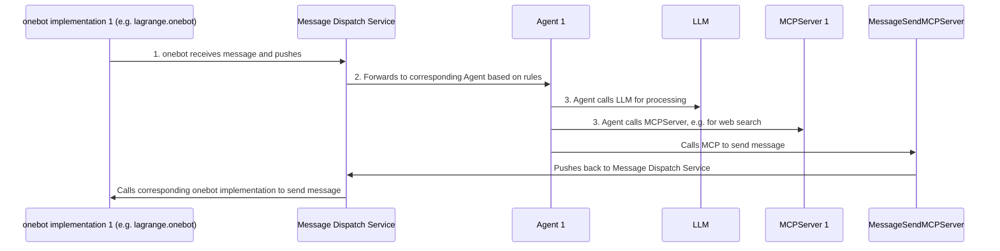

# Cloud-Native Architecture Agent Framework for Onebot Protocol

English | [中文](./docs/README_CN.md) |

## System Architecture

## Interaction Flow

## Service List

### lagrange-core

Executable file for lagrange.onebot.

### message-dispatch

Message dispatch, receiving, and sending service.

### message-mcp

MCP server for sending messages.